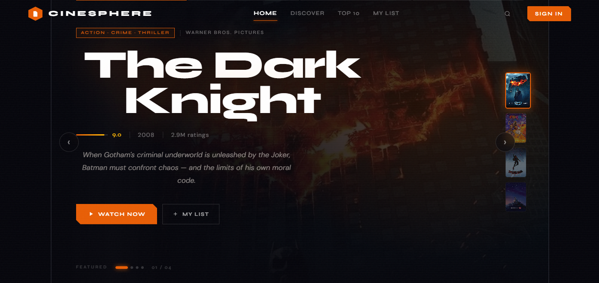
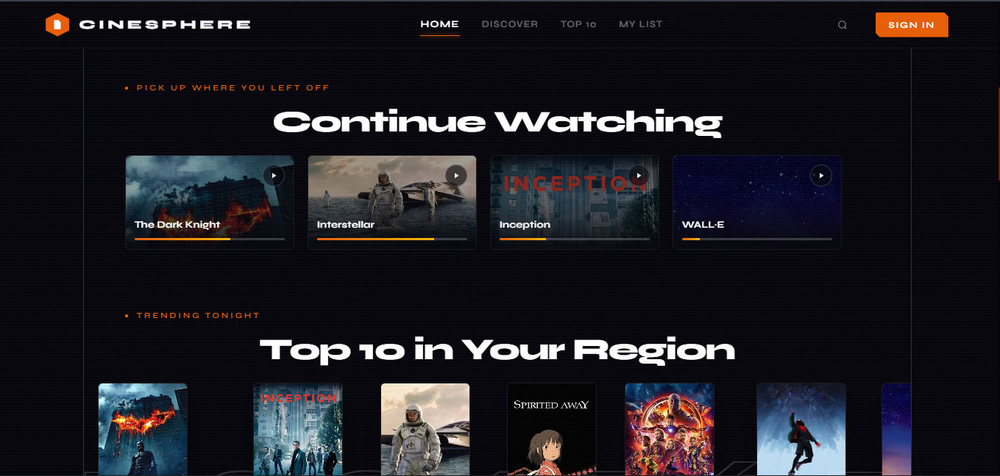

```
░█████╗░██╗███╗░░██╗███████╗░██████╗██████╗░██╗░░██╗███████╗██████╗░███████╗
██╔══██╗██║████╗░██║██╔════╝██╔════╝██╔══██╗██║░░██║██╔════╝██╔══██╗██╔════╝
██║░░╚═╝██║██╔██╗██║█████╗░░╚█████╗░██████╔╝███████║█████╗░░██████╔╝█████╗░░
██║░░██╗██║██║╚████║██╔══╝░░░╚═══██╗██╔═══╝░██╔══██║██╔══╝░░██╔══██╗██╔══╝░░
╚█████╔╝██║██║░╚███║███████╗██████╔╝██║░░░░░██║░░██║███████╗██║░░██║███████╗
░╚════╝░╚═╝╚═╝░░╚══╝╚══════╝╚═════╝░╚═╝░░░░░╚═╝░░╚═╝╚══════╝╚═╝░░╚═╝╚══════╝
```

<div align="center">

```
∿∿∿∿∿∿∿∿∿∿∿∿∿∿∿∿∿∿∿∿∿∿∿∿∿∿∿∿∿∿∿∿∿∿∿∿∿∿∿∿∿∿∿∿∿∿∿∿∿∿∿∿∿∿∿∿∿∿∿∿∿∿∿∿∿∿∿∿∿∿∿∿
```

**A cinematic, dark-mode film discovery platform built with React.**
Browse. Save. Pick up where you left off.

```
∿∿∿∿∿∿∿∿∿∿∿∿∿∿∿∿∿∿∿∿∿∿∿∿∿∿∿∿∿∿∿∿∿∿∿∿∿∿∿∿∿∿∿∿∿∿∿∿∿∿∿∿∿∿∿∿∿∿∿∿∿∿∿∿∿∿∿∿∿∿∿∿
```


</div>

---

## Structure

```
cinesphere/
├── App.jsx          Homepage — carousel, rails, grid, modal, toasts
├── signIn.jsx       Sign-in page — split panel, form, validation
└── README.md
```

---

## Stack

| | |
|---|---|
| UI | React 18, hooks only |
| Styling | Inline CSS-in-JS, injected `<style>` blocks |
| Fonts | Syne (headings) + DM Sans (body) via Google Fonts |
| Images | TMDB image CDN — no API key needed |
| Routing | Internal `page` state — no React Router |
| Build | Vite (recommended) |

---

## Getting Started

```bash
git clone https://github.com/your-username/cinesphere.git
cd cinesphere
npm install
npm run dev
```

Open `http://localhost:5173` and you are running.

```bash
npm run build    # production build → /dist
npm run preview  # preview the production build locally
```

---

## Preview

<table align="center">
<tr>
<td align="center">

<br>
<b>Landing Page</b>
</td>
</tr>

<tr>
<td align="center">

<br>
<b>Movie Discovery</b>
</td>
</tr>

<tr>
<td align="center">

<br>
<b>Authentication</b>
</td>
</tr>
</table>


## Features

```
┌─────────────────────────────────────────────────────────────────┐
│  HOMEPAGE                                                       │
├─────────────────────────────────────────────────────────────────┤
│  Hero carousel        Auto-advancing, 4 featured films          │
│  Continue Watching    16:9 thumbnails with progress bars        │
│  Top 10 Tonight       Ranked rail with oversized numerals       │
│  Recommendations      Genre filter chips + live search          │
│  My List              Persistent across the session             │
│  Movie Modal          Synopsis, cast, runtime, list toggle      │
│  Toast Stack          Add / remove / newsletter confirmations   │
└─────────────────────────────────────────────────────────────────┘
┌─────────────────────────────────────────────────────────────────┐
│  SIGN IN                                                        │
├─────────────────────────────────────────────────────────────────┤
│  Split layout         Cinematic backdrop + sprocket divider     │
│  Validation           Format check, length check, shake error  │
│  States               Idle, loading, error, success            │
│  Auto-return          Returns to homepage after sign-in         │
│  Responsive           Backdrop hidden below 880px              │
└─────────────────────────────────────────────────────────────────┘
```

---

## Design Tokens

```js
bg:      "#04040a"   // page background
bgCard:  "#0c0c16"   // cards, modals
accent:  "#e85d04"   // primary CTA, glows, active states
gold:    "#ffb703"   // ratings, gradient endpoints
text:    "#e8e0d8"   // body copy
```

---

## What Is Missing

These are visible in the UI but not yet wired up:

- Sign-up and forgot-password pages
- A working video / trailer player
- OAuth for Google and Apple sign-in
- Real authentication and a backend
- Data persistence (My List resets on refresh)

---

```
∿∿∿∿∿∿∿∿∿∿∿∿∿∿∿∿∿∿∿∿∿∿∿∿∿∿∿∿∿∿∿∿∿∿∿∿∿∿∿∿∿∿∿∿∿∿∿∿∿∿∿∿∿∿∿∿∿∿∿∿∿∿∿∿∿∿∿∿∿∿∿∿
CineSphere is a front-end prototype. Poster images are served from the
TMDB image CDN for demonstration purposes only. MIT License © 2026.
∿∿∿∿∿∿∿∿∿∿∿∿∿∿∿∿∿∿∿∿∿∿∿∿∿∿∿∿∿∿∿∿∿∿∿∿∿∿∿∿∿∿∿∿∿∿∿∿∿∿∿∿∿∿∿∿∿∿∿∿∿∿∿∿∿∿∿∿∿∿∿∿
```